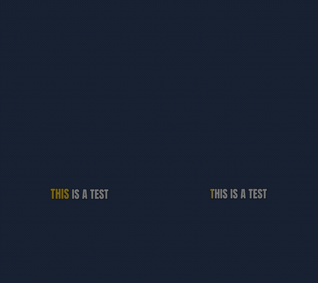
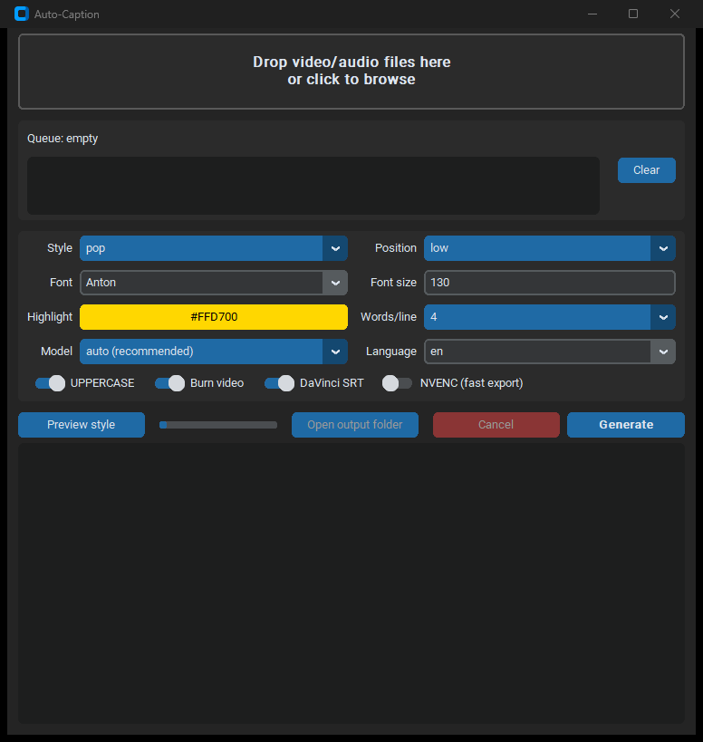

# auto-caption

**Free, local, CapCut-style karaoke captions for shorts & reels.** No
subscriptions, no watermarks, no uploads — everything runs on your machine.

[](https://github.com/sebetancurch/auto-caption/actions/workflows/ci.yml)
[](LICENSE)
[](https://www.python.org/)



Feed it a video (or audio) file and it:

1. **Transcribes** the speech locally with word-level timestamps
   ([faster-whisper](https://github.com/SYSTRAN/faster-whisper))
2. **Groups** the words into short caption lines tuned for 9:16 vertical video
3. **Generates** an `.ass` subtitle file with per-word karaoke animations
4. **Burns** the captions into the video with FFmpeg — and always saves the
   subtitle files too, in case you'd rather finish in an editor

```text
autocaption clip.mp4
   → clip.captioned.mp4   final video with animated captions
   → clip.ass             the animated subtitles (mpv, VLC, DaVinci, re-burnable)
   → clip.davinci.srt     karaoke SRT for DaVinci Resolve's subtitle track
```

## Install

**Requirements:** [Python 3.10+](https://www.python.org/downloads/) and
[FFmpeg](https://ffmpeg.org/download.html).

```bash
# 1. FFmpeg (skip if you have it)
#    Windows:      winget install Gyan.FFmpeg
#    macOS:        brew install ffmpeg
#    Linux:        sudo apt install ffmpeg

# 2. Get the code and install
git clone https://github.com/sebetancurch/auto-caption
cd auto-caption
python -m venv .venv
# Windows: .venv\Scripts\activate     macOS/Linux: source .venv/bin/activate
pip install -e .
```

The first run downloads a Whisper model (~500 MB for the default CPU model) to
your Hugging Face cache; after that everything works offline.

## The GUI



| Platform | Launch |
|----------|--------|
| Windows  | double-click **`AutoCaption.bat`** (or `autocaption-gui`) |
| macOS / Linux | `autocaption-gui` (or `python -m autocaption.gui`) |

- **Drag & drop** one or more video/audio files — they queue up and process
  one after another
- Pick **style, position, font (all your installed fonts), highlight color,
  Whisper model, language, font size and words per line** from dropdowns
- **Preview style** renders a sample caption frame with your current settings
  before you process anything
- Live log, **cancel** mid-run, **open output folder** on the result
- Settings are remembered between launches

## The CLI

```bash
autocaption clip.mp4                              # default "pop" style
autocaption clip.mp4 --style karaoke
autocaption clip.mp4 --highlight-color 00FF88 --position mid --nvenc
autocaption podcast.mp3                           # audio → subtitle files only
```

| Flag | Meaning (default) |
|------|-------------------|
| `--style pop\|karaoke` | caption style (`pop`) |
| `--model NAME` | whisper model (auto: `medium.en` on GPU, `small.en` on CPU) |
| `--device auto\|cuda\|cpu` | inference device (`auto`, safe CPU fallback) |
| `--language XX` | audio language, `auto` to detect (`en`) |
| `--highlight-color HEX` | active-word color (`#FFD700`) |
| `--font NAME` | font (bundled **Anton**; any installed font works) |
| `--font-size N` | size at 1080×1920 reference scale (`130`) |
| `--caps / --no-caps` | UPPERCASE captions (on) |
| `--words-per-line N` / `--max-chars N` | line length limits (`4` / `18`) |
| `--position high\|mid\|low` | vertical placement (`low` ≈ 68% down, clear of TikTok UI) |
| `--no-burn` | only write subtitle files |
| `--no-srt` | skip the DaVinci `.srt` |
| `--nvenc` | encode with NVIDIA NVENC (much faster export) |
| `-o PATH` | output video path (`<input>.captioned.mp4`) |

## Styles

| `pop` (default) | `karaoke` |
|---|---|
|  |  |
| The spoken word flashes the highlight color and does a quick scale "pop" — the classic CapCut/TikTok look | The highlight sweeps smoothly *through* each word as it's spoken, karaoke-lyrics style |

Tip: `--words-per-line 1` gives you the big one-word-at-a-time style used in
podcast/motivational clips. Presets are small dataclasses in
[`autocaption/styles.py`](autocaption/styles.py) — adding your own is easy.

## Using the files in DaVinci Resolve

- **`.davinci.srt`** — import into a subtitle track (`File → Import →
  Subtitle`). It contains one block per spoken word with the active word
  wrapped in a `<font color>` tag; Resolve renders the tags, so the highlight
  jumps word-to-word on playback (most other editors strip them — that's why
  the burn-in path is the default). Style the track in the Inspector and add a
  Text+ animation or Dynamic Zoom on top for extra motion.
- **`.ass`** — keeps the full animations; preview with mpv/VLC or re-burn
  later: `ffmpeg -i in.mp4 -vf "ass=subs.ass" out.mp4`

## GPU acceleration (optional)

Transcription is fast on CPU (a 60 s short takes a few seconds). For NVIDIA
GPU inference, install the CUDA runtime DLLs into your venv and `--device
auto` picks them up automatically:

```bash
pip install nvidia-cublas-cu12 nvidia-cudnn-cu12
```

Video *encoding* can use your GPU regardless via `--nvenc`.

## Troubleshooting

- **"ffmpeg not found"** — install FFmpeg (commands above) and open a new
  terminal. Without it you still get subtitle files, just no burned video.
- **First run seems stuck** — it's downloading the Whisper model (one time).
- **"cuda failed ... falling back"** — harmless; GPU DLLs are missing so it
  transcribes on CPU. See GPU section.
- **Captions look tiny/huge on unusual resolutions** — tune `--font-size`; it
  scales relative to a 1080×1920 frame.

## Credits

- [faster-whisper](https://github.com/SYSTRAN/faster-whisper) (MIT) for local
  speech-to-text, and [FFmpeg](https://ffmpeg.org/) + libass for rendering
- [customtkinter](https://github.com/TomSchimansky/CustomTkinter) (MIT) for
  the GUI
- Bundled font: [Anton](https://fonts.google.com/specimen/Anton) by Vernon
  Adams, licensed under the [SIL Open Font License 1.1](autocaption/fonts/OFL.txt)

## License

[MIT](LICENSE) © Sergio Betancur Chaves
